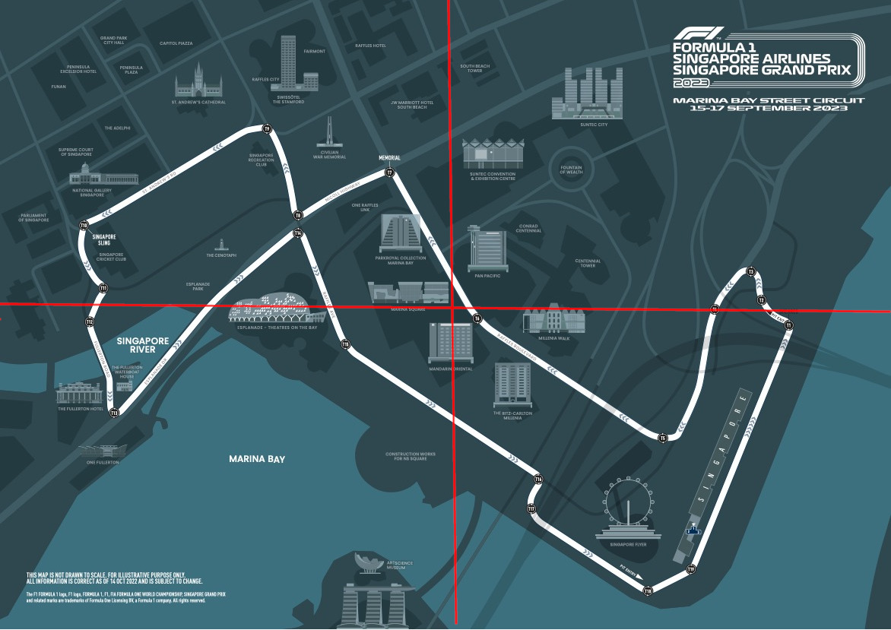

# MarinaBayF1Circuit3D

A basic OpenGL project that renders a 3D grid, color-coded axes, and customizable camera controls, designed as a foundational setup for learning 3D graphics programming.

## Marina Bay Circuit Guide

## Singapore Flyer 

